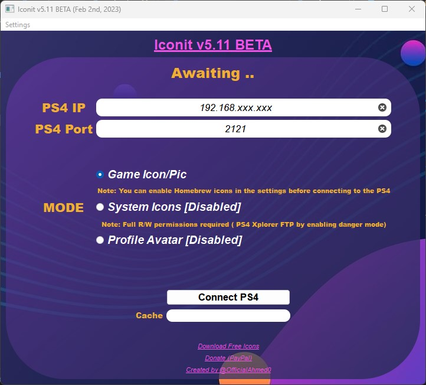
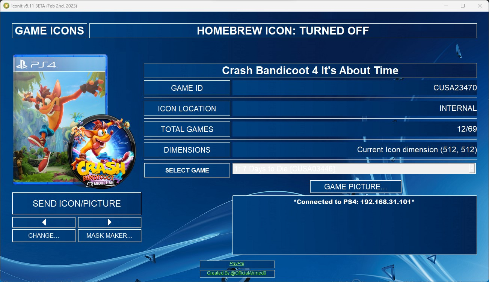

# Overview

_Latest `exe` version `5.06 BETA (Jan 29th, 2023)`_

_Currently working on `v5.56` mainly for performance & code factorization for `PS5 FTP` in the future_.

*Download `icons` from <https://all-exhost.github.io/Icons.html>*

*Download `masks` from <https://all-exhost.github.io/Masks.html>*

*Download `.exe` the latest windows executable version from* <https://github.com/OfficialAhmed/Iconit-PS4/releases>

## About

Pure Python implementation of an automated software to change `PS4` xmb icons, pictures and profile avatars. PS4 (5.05 - 9.00).

This application is much convenient than uploading the icons manually, it automates the following:

* Icon duplication 
* Backup original icons `icon0, icon1, ...`
* Upload and overwrite icons to the `PS4`  
* Game ID `CUSA` to game title conversion
* Image conversion `JPG, ICO, ...` to `PNG`
* Image to compressed textures conversion `PNG` to `DDS dxt1`
* Resize images to the required size `512x512`, `1920x1080`

________________________________________

## *What's new in v5 BETA*

#### _For end users:_

*  Finally `Independent version` ImageMagick is no longer required
*  In the `Games List` _Game IDs_ now shown next to the game title
*  `Modes` can be changed without restarting the program
*  `Backup icons` will never be overwritten nor removed [_used to cache once then overwrite the older one_]
*  `Circular icon scrolling` when the last icon's reached, it'll begin again from the start and vice versa.
*  `Faster caching` new techniques added
*  `New option` __Download database__ for a faster caching process
 
#### _For developers:_
*  `Local database` implemented & fetched from [DEFAULTDNB](https://github.com/DEFAULTDNB/DEFAULTDNB.github.io). For game titles caching "_Read [wiki](https://github.com/OfficialAhmed/Iconit-PS4/wiki/Performance) for detailes_"
*  `Subproccess` implementation to convert `PNG` to `DDS` DXT1 compression using [DirectXTex/texconv](https://github.com/Microsoft/DirectXTex/wiki/Texconv)
*  `Buffer size` increased to ~65500 bytes
*  `Clean up` code and files structure
*  `OOP implementation` Better performance & less memory usage
________________________________________

## *Current implementation Main bugs* 
 This version isn't ready for end-users
1. Avatars option patch required

## _To do list_

* [ ] Multiple icon change
* [ ] Apply mask on all xmb icons at once
* [ ] Render Game ID `CUSAXXXXX` text on icon
* [ ] Utilize 100% CPU usage `Multiprocessing`
* [x] Copy multiple icons - heavy R/W Bound `Threading`
* [ ] Feature : User can edit displayed game title through cache file
* [ ] Feature : Read titles from xmb DB 

## _Credits_
* Special thanks to [@Lapy](https://twitter.com/Lapy05575948) for the help.
* Special thanks to [@DEFAULTDNB](https://github.com/DEFAULTDNB) AKA [@KiiWii](https://twitter.com/DefaultDNB) for the Database

    ### _Testers_:
* [@laz305](https://twitter.com/laz305)
* [@maxtinion](https://twitter.com/maxtinion)
* [@_deejay87_](https://twitter.com/_deejay87_)
* [@PS__TRICKS](https://twitter.com/PS__TRICKS)

## _Contribution_
Don't hesitate to contact [me](https://twitter.com/OfficialAhmed0) for new suggestions and ideas 

## _Preview_

# License
Iconit-PS4 - Copyright (C) 2019-2023 OfficialAhmed

This software is free to use, distribute and/or modify it under the terms of the [MIT License](LICENSE) (MIT)
