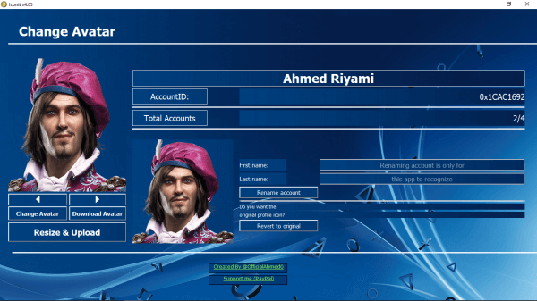
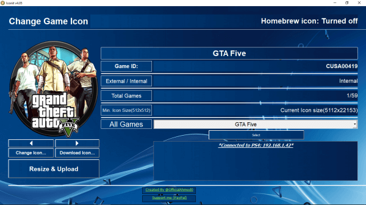

# Main bugs

FIXME: Avatars & sys icons needs a fix patch after this implemetation

BUG: Multiproccessing techniques reimplementation

# Iconit

Latest version 4.72 (Jan 5, 2022)

Pure Python implementation of an automated software to change PS4 xmb icons, pictures and profile avatars. PS4 FTP required (PS4 fw "1.74-9.00").

*Download `icons` from <https://all-exhost.github.io/Icons.html>*

*Download `masks` from <https://all-exhost.github.io/Masks.html>*

*Download the windows executable version `.exe` down below*

## Download

**Latest Iconit version**
<https://github.com/OfficialAhmed/Iconit-PS4/releases>

## About

This application is much convenient than uploading the icons manually, it automates the following

* Game ID `CUSA` to game title conversion

* Resize images to the required size `512x512`

* Image format convertion `JPG, ICO ...` to `PNG`

* Image to textures convertion `PNG` to `DDS`

* Icon duplication 

* Backup original icons

* Upload and overwrite icons to the PS4  

________________________________________

## What's new

* `Circular icon scrolling` When the last icon reached, it'll begin again from the start and vice versa. 

* Game ID now shown next to the game title `Games List`

* Better performance & less memory usage `OOP implementation`

* Change between modes without restarting the program

## To do list

* [ ] Apply `PSD` Masks

* [ ] Render Game ID `CUSAXXXXX` text on icon

* [ ] Multiple icon change

* [ ] Apply mask on all xmb icons at once

* [ ] Utilize 100% CPU usage `Multiprocessing`

* [ ] Feature : User can edit displayed game title through cache file

## Credits

* Sound Effect from Pixabay

## Contribution

Do not hesitate to send me new suggestions and ideas for the application.

<https://twitter.com/OfficialAhmed0>

## Pictures

